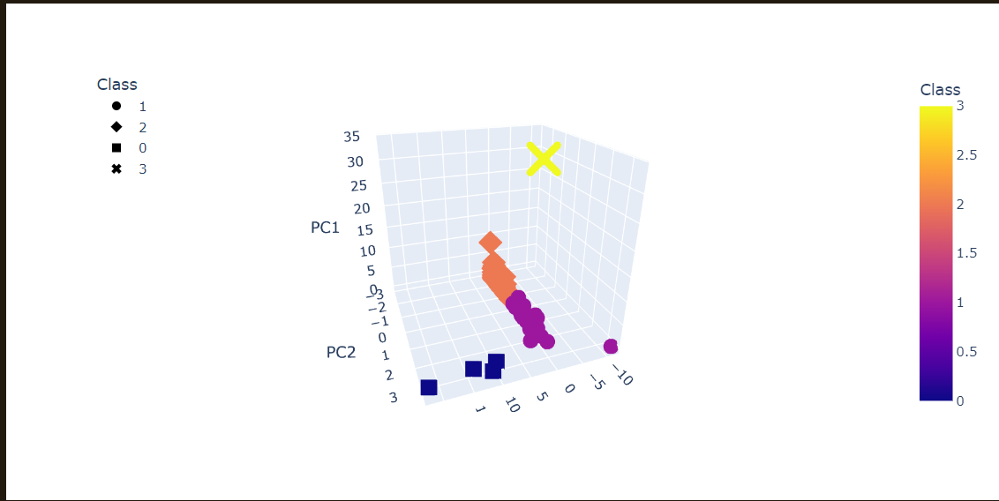
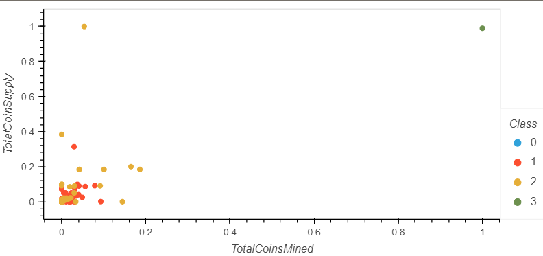

# Cryptocurrency Investment Portfolio Analysis

This repository contains a project that aims to analyze the cryptocurrency market for creating a new investment portfolio. The project uses unsupervised learning techniques to process, cluster, and visualize cryptocurrency data to classify and better understand the vast universe of cryptocurrencies.

## Project Overview

The project consists of four main parts:

1. **Part 1: Preprocessing the Data for PCA** - The cryptocurrency data will be preprocessed to fit the machine learning models, including cleaning, transforming, and scaling the data.
2. **Part 2: Reducing Data Dimensions Using PCA** - Principal Component Analysis (PCA) will be applied to reduce the data dimensions and extract the most relevant features from the dataset.
3. **Part 3: Clustering Cryptocurrencies Using K-means** - K-means clustering algorithm will be used to group cryptocurrencies based on their similarities and create a classification system for the new investment portfolio.
4. **Part 4: Visualizing Cryptocurrencies Results** - The results of the clustering will be visualized using various data visualization techniques to effectively communicate the findings.

## Results
Initially, I cleaned the dataset to retain only cryptocurrencies that are actively traded, possess a defined algorithm, and have a complete set of data points. This refinement led to a dataset containing 532 distinct cryptocurrencies. Subsequently, I generated a three-dimensional graph to visualize the grouping of these cryptocurrencies. Each point on the graph represents a cryptocurrency and displays its name along with the algorithm employed for its creation.

Subsequently, I generated a two-dimensional graph to demonstrate the relationship between total coin supply and total coins mined, showcasing how each currency compares to the rest. Each point on this graph includes its corresponding currency name.

